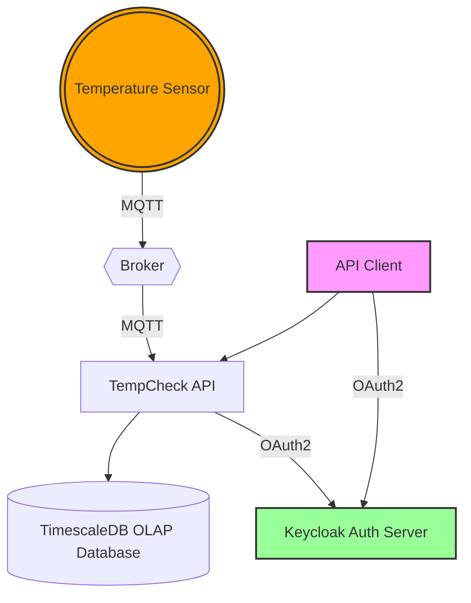

# TempCheck API

A FastAPI-based REST API for managing IoT sensor readings and analytics with MQTT integration and TimescaleDB storage.

## Features

- Real-time temperature sensor readings via MQTT
- Sensor provisioning management
- Time-series data storage in using TimescaleDB
- Authentication and authorization (OAuth 2)

## Structure

